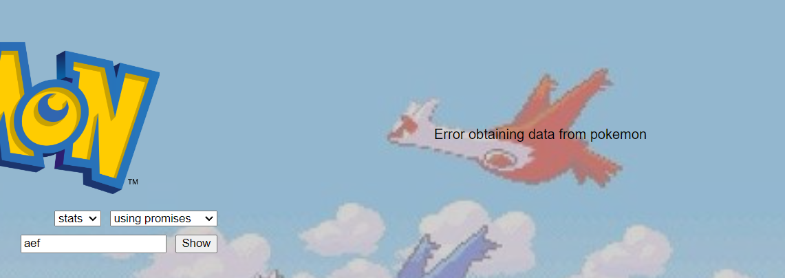

# Consume-API-vanilla
Simple web page designed to practice asynchrony in JS. We use promises and async-await to fetch text and images from the API pokeapi.co. Not responsive.

There are 2 combo boxes, one to choose between searching for images or text, and the other to choose between using asyncawait or promises to fetch that data from the pokeapi.

And of course, there's an input to write the pokemon you want to search for (pokédex number or pokémon name are both valid).

When the "Search" bottom  is pressed, the searchPokemon() method is initialized. This method takes the pokemon to search from the input, and the info of the content you want to see and the way you want to fetch it from the combo boxes. 

If there's an error (because the pokemon you try to search doesn't exist), the page will display a message on the right.

If everything is successful, image or text will be displayed there.

- Web: https://lbdavid17.github.io/consume-API-vanilla/

